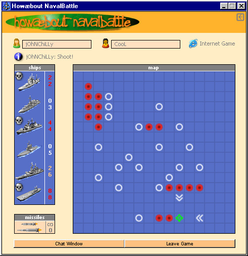



## \[ Best NavalBattle Game \]

### Description

This is the best Naval Battle game ever created.

There are 6 different ships and two kind of weapons.

You can play against an intelligent computer or a friend on the same PC.

Or you can play with someone through LAN or Internet.

Also it saves top 10 high scores for single player games.

Lastly, it has some secrets waiting to be found.

Please vote for it and dont forget to give feedback!
 
### More Info
 

             |
---                |---
**Submitted On**   |2005-01-18 22:37:14
**By**             |[Can Cilli](https://github.com/Planet-Source-Code/PSCIndex/blob/master/ByAuthor/can-cilli.md)
**Level**          |Advanced
**User Rating**    |4.9 (206 globes from 42 users)
**Compatibility**  |VB 6\.0
**Category**       |[Games](https://github.com/Planet-Source-Code/PSCIndex/blob/master/ByCategory/games__1-38.md)
**World**          |[Visual Basic](https://github.com/Planet-Source-Code/PSCIndex/blob/master/ByWorld/visual-basic.md)
**Archive File**   |[\[\_Best\_Nav1842531212005\.zip](https://github.com/Planet-Source-Code/can-cilli-best-navalbattle-game__1-58416/archive/master.zip)

